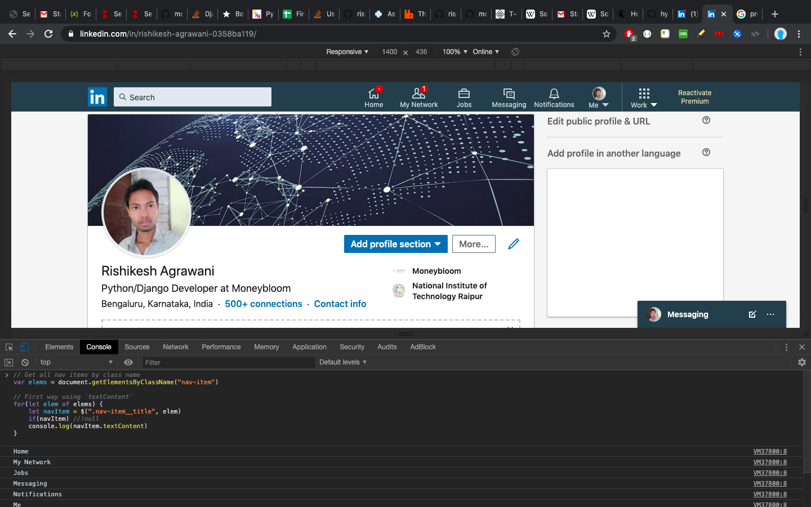

# hacky2020

A repository containing full of code snippets to manipulate the DOM of popular websites (secret) and perform time taking actions quickly in seconds. 

## Why did I create this project?

+ I love JavaScript/jQuery.
+ I am very curious to know about internal working (API calls, DOM change on actions/events etc.) in websites of Amazon, Linkedin, Facebook, Google etc.
+ When I was sending requests to people in Linkedin, I found it as repeating & time consuming work.
+ Later, I thought to solve this using JavaScript/jQuery and I succeeded (long back) but I didn't save my code anywhere.
+ In this new year(2020), almost after 2-3 months since last attempt, again I inspected webpage and did R&D. It was again a rework of what I had already done before.
+ Finally, I decided to get rid of this problem and share my work with the world.

**Note:** I have created this project for my personal use and save my hacky, R&D related code snippets. So be careful and don't misuse it anywhere.

Let's have look at below examples. It will also help users/developers/newbies to learn JavaScript/jQuery. Examples are documented, easy and straightforward.

> **`$`** &raquo; **`ƒ $(selector, [startNode]) { [Command Line API] }`**

## Linkedin 

Have a look at the attached images related to this section at [Linkedin Hacky Images](./docs/2020/jan/nidknil.md).

### Single connection request
> Attempted on Wed, Jan 1, 2020

```javascript
// Get element
var elem = $("button[data-control-name='people_connect']")

// Click on element
elem.click()
````

### Multiple connection requests
> Attempted on Wed, Jan 1, 2020

```javascript
// Get all buttons
var buttons = document.getElementsByTagName("button")

// Iterate over buttons
for(let button of buttons) {
    attribName = button.getAttribute('data-control-name')
    
    if(attribName === 'people_connect') {
        // Click on button to send connection request
        button.click() 
    }
}
```


## GitHub

### Open the contributors link in new tab
> Attempted on Wed, Jan 1, 2020

```javascript
// Open in new tab (By default, GitHub doesn't open link new tab).
// Clicking on the contributors link.
var contributors = $('a[data-hovercard-type="contributors"]')

// Set attribute as target='blank'
contributors.setAttribute("target", "_blank")

// Click on the link
contributors.click()
```

### Raising/Creating pull request - open in new tab
> Attempted on Wed, Jan 1, 2020

```javascript
// Get anchor link element
var newPullReqBtn = document.getElementsByClassName('new-pull-request-btn')[0]

// First check if target is set or not (which is actually `null`)
newPullReqBtn.getAttribute("target")

// Set attribute to open in new tab
newPullReqBtn.setAttribute("target", "_blank")

// Click on link
newPullReqBtn.click()
```

### Printing added topics to the repository
> Attempted on Wed, Jan 1, 2020

```javascript
// Get list of elements by class name
let elems = document.getElementsByClassName("topic-tag-link")

// Printing the text (topic)
for(let elem of elems) {
    console.log(elem.innerText)
}
```

### Printing all commits
> Attempted on Wed, Jan 1, 2020

```javascript
// Get all elements (links `a` with class `message`) 
var commitsElems = document.getElementsByClassName("message")
/*
    HTMLCollection(8) [a.message.js-navigation-open, a.message.js-navigation-open, a.message.js-navigation-open, a.message.js-navigation-open, a.message.js-navigation-open, a.message.js-navigation-open, a.message.js-navigation-open, a.message.js-navigation-open]
*/


// Printing innerText of all commits
for(let commitElem of commitsElems) {
    console.log(commitElem.innerText)
}
/*
    added script to print topics added to repo
    updated script to create pull request in next tab
    added images related to Linkedin Hacky Images
    updated README.md with update on details
    added script to click on GitHub's contributors to open in new tab
    added js scripts for single & multple connection requests sending hac…
    Set theme jekyll-theme-cayman
    Initial commit
*/
```

### Printing nav items text (innerText)

> Attempted on Thu, Jan 2, 2020

```javascript
/*
    Aim
    ===
    To print text of Linkedin's nav bar i.e. Home, My Network etc. 

    Coded on
    ========
    Thu, Jan 2, 2020
    
    By
    ==
    Rishikesh Agrawani

    Got idea from
    =============
    $ -> ƒ $(selector, [startNode]) { [Command Line API] }
*/

// Get all nav items by class name 
var elems = document.getElementsByClassName("nav-item")

// First way using `textContent`
for(let elem of elems) {
    let navItem = $(".nav-item__title", elem)
    if(navItem) //!null
    console.log(navItem.textContent)
}

// Second way using `innerText`
for(let elem of elems) {
    let navItem = $(".nav-item__title", elem)
    if(navItem) //!null
    console.log(navItem.innerText)
}

/*
    Home
    My Network
    Jobs
    Messaging
    Notifications
    Me
    Work
*/
``` 



